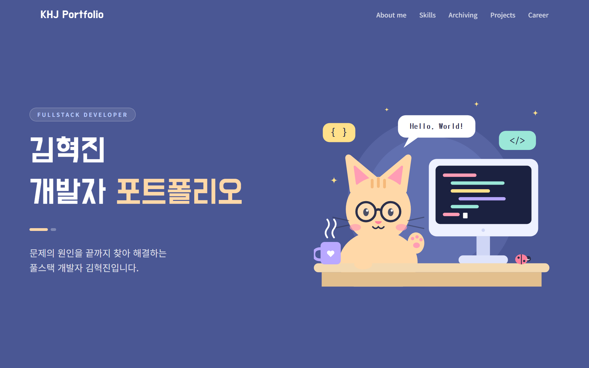
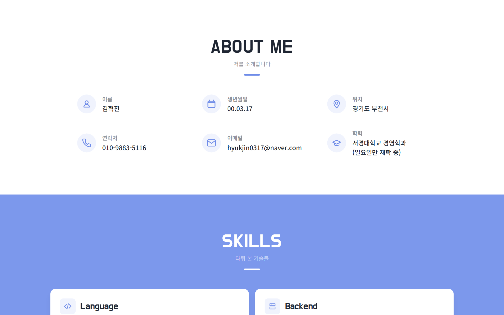
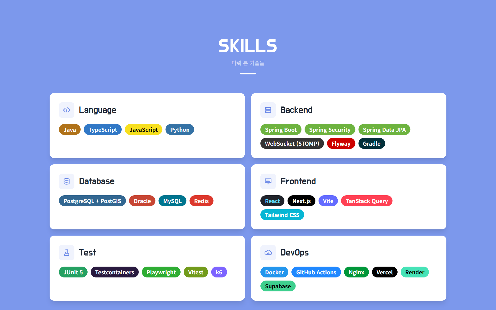
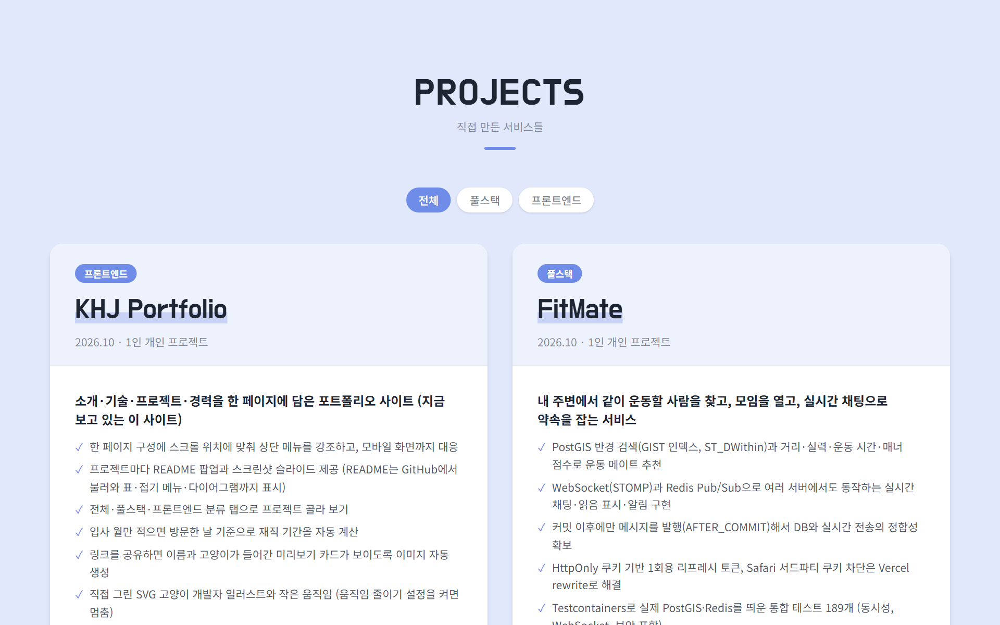
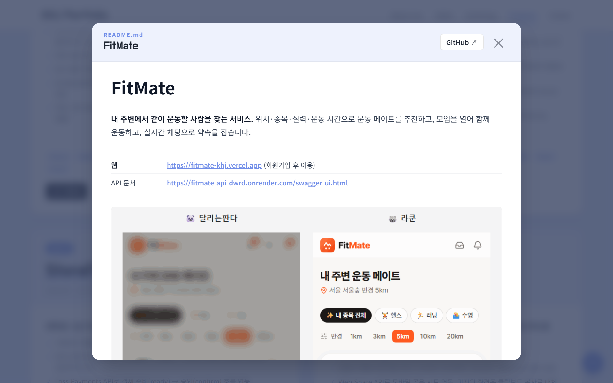
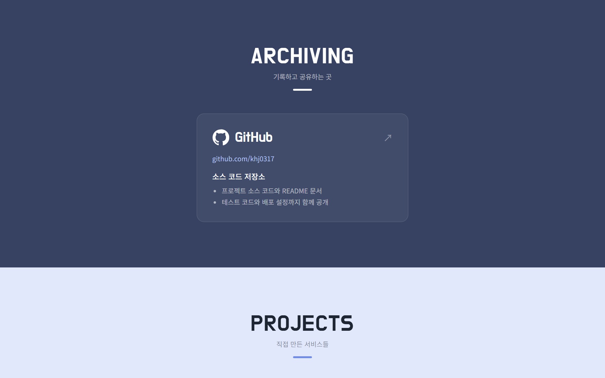
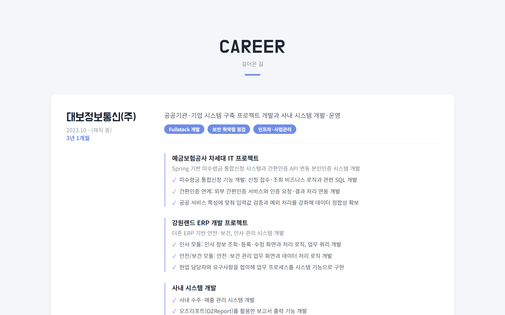
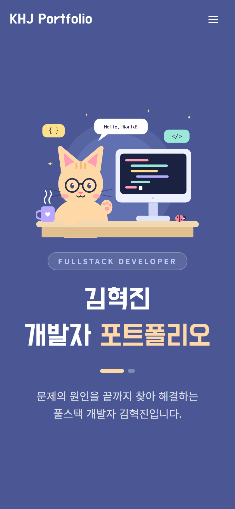
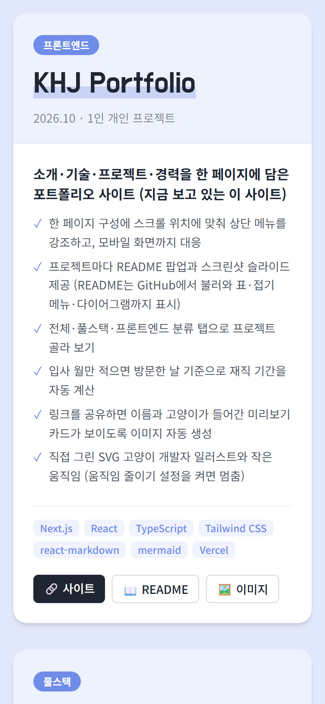
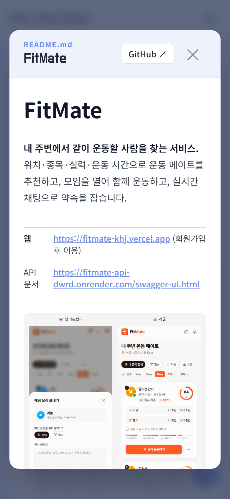

# KHJ Portfolio

**풀스택 개발자 김혁진의 포트폴리오 사이트.** 소개, 기술, 프로젝트, 경력을 한 페이지에 담고, 각 프로젝트의 README를 사이트 안에서 바로 읽을 수 있게 만들었습니다.

| | |
|---|---|
| **웹** | **https://hyeokjin-portfolio.vercel.app** |

디자인, 일러스트, 개발, 배포까지 직접 진행한 프로젝트입니다.



## 주요 기능

- **직접 그린 고양이 개발자 일러스트**: SVG로 그려서 저작권 걱정이 없고, 눈 깜빡임·손 흔들기·커피 김 같은 작은 움직임을 넣음 (움직임 줄이기 설정을 켠 사용자에게는 멈춤)
- **README 팝업**: 프로젝트의 README를 GitHub에서 그때그때 불러와 사이트 안에서 보여 줌. 스크린샷·표·접기 메뉴·다이어그램까지 그대로 표시
- **스크린샷 슬라이드**: 프로젝트마다 화면을 크게 넘겨 보기 (ESC·방향키 지원)
- **프로젝트 분류 탭**: 전체 / 풀스택 / 프론트엔드
- **재직 기간 자동 계산**: 입사 월만 적어 두면 방문한 날짜 기준으로 "3년 1개월"처럼 표시
- **현재 위치 메뉴 강조**: 스크롤하는 섹션에 맞춰 상단 메뉴에 밑줄 표시
- **링크 미리보기**: 카카오톡·슬랙에 링크를 붙이면 이름과 고양이가 들어간 카드가 보임
- **모바일 대응**: 햄버거 메뉴, 한 줄 배치, 가로 스크롤 없음

## 화면

<table>
  <tr><th>About me</th><th>Skills</th></tr>
  <tr><td></td><td></td></tr>
</table>

<table>
  <tr><th>Projects</th><th>README 팝업</th></tr>
  <tr><td></td><td></td></tr>
</table>

<table>
  <tr><th>Archiving</th><th>Career</th></tr>
  <tr><td></td><td></td></tr>
</table>

<table>
  <tr><th>모바일 첫 화면</th><th>모바일 프로젝트</th><th>모바일 README 팝업</th></tr>
  <tr><td></td><td></td><td></td></tr>
</table>

**링크 미리보기 이미지**


## 구성

```
첫 화면 → About me → Skills → Archiving → Projects → Career
                                              │
                                              ├─ README 팝업 ── GitHub에서 README.md를 불러와 그림
                                              │                (상대 경로 이미지는 GitHub 주소로 변환,
                                              │                 mermaid 다이어그램은 그림으로)
                                              └─ 이미지 팝업 ── public/projects/ 의 스크린샷
```

| 영역 | 기술 |
|---|---|
| Web | Next.js 16 (App Router), React 19, TypeScript |
| 스타일 | Tailwind CSS v4, `@tailwindcss/typography` (README 본문) |
| README 팝업 | `react-markdown`, `remark-gfm`, `rehype-raw`, `rehype-sanitize`, `mermaid` |
| 이미지 | `next/og` (링크 미리보기 카드) |
| Infra | Vercel |

## 핵심 구현과 문제 해결

### 1. 다른 저장소의 README를 사이트 안에서 그대로 보여 주기
- **문제**: README를 사이트에 복사해 두면 GitHub에서 README를 고칠 때마다 사이트도 같이 고쳐야 함. 그대로 불러오면 `docs/screenshots/a.png` 같은 **상대 경로 이미지가 깨지고**, FitMate README의 접기 메뉴(`<details>`)도 그냥 글자로 나옴
- **해결**
  - `raw.githubusercontent.com`에서 README를 바로 불러오고, 상대 경로는 이미지면 원본 파일 주소로, 링크면 GitHub 문서 주소로 바꿈 (`urlTransform`)
  - HTML을 그리도록 `rehype-raw`를 켜되, 남의 글을 그대로 넣는 것이므로 **`rehype-sanitize`로 위험한 태그와 속성을 걸러냄**
  - 한 번 불러온 README는 메모리에 저장해서 다시 열 때 바로 보여 줌
- **결과**: 세 프로젝트 README를 모두 열어 이미지가 전부 불러와지는 것까지 확인

### 2. README를 고쳤는데 팝업에는 예전 내용이 보이는 문제
- **문제**: MBTI README를 새로 써서 push했는데, 사이트 팝업에는 계속 예전 README가 보임
- **원인**: GitHub 원본 파일 서버가 `Cache-Control: max-age=300`으로 응답해서 **CDN과 브라우저가 5분 동안 예전 파일을 그대로 씀**. `curl`로 커밋 주소를 직접 열어 새 내용이 올라간 것은 확인했으므로 사이트 문제가 아니라 캐시 문제로 판단
- **해결**: 팝업을 열 때 `fetch(url, { cache: "no-cache" })`로 요청해서, 브라우저가 저장된 사본을 쓰기 전에 **GitHub에 바뀐 내용이 있는지 매번 확인**하게 함. 바뀌지 않았으면 저장된 사본을 쓰므로 느려지지 않음

### 3. README 안의 큰 ERD 다이어그램
- **문제**: FitMate README의 ERD(mermaid)가 코드 글자로만 보임. 그림으로 바꾸니 **원래 폭이 2,887px**이라 팝업에 맞추면 글자가 너무 작고, 원래 크기로 두면 빈 귀퉁이만 보임
- **해결**
  - `mermaid` 코드 블록만 골라 그림으로 그림. 라이브러리가 커서 **다이어그램이 있는 README를 열 때만 불러옴** (`import("mermaid")`)
  - 처음에는 팝업 폭에 맞추고, **"🔍 크게 보기"** 버튼으로 원래 크기와 가로 스크롤로 전환
  - 보안 수준을 `strict`로 두어 정리된 SVG만 화면에 넣음
- **같이 고친 것**: 글자 꾸밈 플러그인이 짧은 코드 앞뒤에 백틱(`)을 붙이고, 어두운 코드 블록 안 글자에도 밝은 배경을 칠해 안 보이게 만드는 문제를 스타일로 따로 정리

### 4. 배포했더니 링크 미리보기 이미지가 다른 주소를 가리키는 문제
- **문제**: 배포 후 페이지를 확인해 보니 `og:image`가 실제 주소(`hyeokjin-portfolio.vercel.app`)가 아니라 **Vercel이 처음 정한 주소**를 가리킴. 그 주소는 307로 넘겨 주긴 하지만, 메신저가 미리보기 이미지를 가져올 때 이동을 따라가지 않으면 이미지가 빠짐
- **원인**: 기준 주소를 Vercel이 넣어 주는 `VERCEL_PROJECT_PRODUCTION_URL`로 정했는데, 이 값은 나중에 추가한 도메인이 아니라 처음 주소였음
- **해결**: 실제 배포(`VERCEL_ENV=production`)에서는 데이터 파일의 `profile.siteUrl`을 쓰고, 미리보기 배포와 로컬에서는 각자의 주소를 쓰도록 나눔. 다시 배포한 뒤 `og:image`가 새 주소를 가리키고 PNG가 내려오는 것까지 확인

### 5. 한글이 들어간 링크 미리보기 이미지
- **문제**: `next/og`로 그리는 이미지는 시스템 폰트를 쓰지 않아서, 폰트를 넣지 않으면 한글이 깨짐. 한글 폰트 전체는 수 MB라 함께 넣기 부담스러움
- **해결**: 빌드할 때 Google Fonts의 `text=` 옵션으로 **이미지에 실제로 들어가는 글자만 담긴 폰트 조각**을 받아서 그림. 고양이는 SVG로 다시 그려 이미지 안에 넣음
- 이미지는 빌드할 때 한 번 만들어 두는 정적 파일이라 방문할 때마다 다시 그리지 않음

### 6. 빌드한 날과 방문한 날이 다른 재직 기간
- **문제**: 사이트는 빌드할 때 HTML을 미리 만들어 두기 때문에, 재직 기간을 서버에서 계산하면 **빌드한 날 기준으로 멈춤**
- **해결**: 계산을 방문자의 브라우저에서 다시 하도록 하고, 빌드 시점 값과 달라도 경고가 나지 않게 `suppressHydrationWarning`을 그 숫자에만 적용. 시작 월과 마지막 월을 모두 포함해 셈 (2023.10 → 2026.10 = 3년 1개월)

## 설계 상세

<details>
<summary><b>내용은 파일 하나에서 관리</b></summary>

화면에 보이는 글은 대부분 [`src/data/portfolio.ts`](src/data/portfolio.ts)에 모여 있어서, 컴포넌트를 건드리지 않고 내용을 바꿀 수 있습니다.

| 바꾸고 싶은 것 | 위치 |
|---|---|
| 이름, 소개 문구, 로고, 사이트 주소 | `profile` |
| About me | `about` |
| 기술 스택 (배지 색 포함) | `skills` |
| GitHub 등 링크 | `archiving` |
| 프로젝트 (스크린샷은 `public/projects/`) | `projects` |
| 경력 (`end`를 비우면 재직 중) | `careers` |

- 프로젝트 README 주소는 따로 적지 않고 `github` 주소에서 만들어 냄
- 경력을 비우면 Career 섹션과 메뉴가 함께 사라짐

</details>

<details>
<summary><b>색상</b></summary>

섹션 색은 [`src/app/globals.css`](src/app/globals.css)의 `@theme`에 모아 두었습니다.

| 이름 | 색 | 쓰는 곳 |
|---|---|---|
| `hero` | `#4a5794` | 첫 화면 |
| `band` | `#7c98ec` | Skills 배경 |
| `accent` | `#6f8ce8` | 버튼, 배지, 아이콘 |
| `navy` | `#374262` | Archiving, 팝업 배경 |
| `career` | `#e1e8fb` | Projects 배경 |
| `paper` | `#f4f6fa` | Career 배경 |

포인트 색(`accent`)은 Skills 배경(`band`)과 같은 톤에서 아주 조금 진하게 잡았습니다. 흰 바탕 위 작은 글씨로도 쓰이기 때문에, 같은 색을 그대로 쓰면 잘 읽히지 않았습니다.

</details>

<details>
<summary><b>현재 섹션 메뉴 강조</b></summary>

- 스크롤할 때마다 화면 위쪽 40% 지점을 지난 마지막 섹션을 현재 섹션으로 판단
- 페이지 맨 아래에 닿으면 마지막 메뉴(Career)를 강조. 마지막 섹션은 키가 짧아서 40% 지점에 닿지 못하기 때문
- 첫 화면에서는 아무 메뉴도 강조하지 않음

</details>

## 프로젝트 구조

```
portfolio/
├─ src/app/
│  ├─ layout.tsx              폰트, 사이트 설명, 링크 미리보기 설정
│  ├─ page.tsx                섹션 순서
│  ├─ opengraph-image.tsx     링크 미리보기 이미지
│  ├─ icon.svg                파비콘
│  └─ globals.css             색상, 일러스트 애니메이션
├─ src/components/
│  ├─ Hero.tsx, HeroIllustration.tsx   첫 화면과 고양이 일러스트
│  ├─ Projects.tsx            프로젝트 카드, 분류 탭
│  ├─ ReadmeModal.tsx         README 팝업
│  ├─ MermaidBlock.tsx        README 안의 다이어그램
│  ├─ ImageModal.tsx          스크린샷 슬라이드
│  ├─ CareerPeriod.tsx        재직 기간 계산
│  └─ Header.tsx, About.tsx, Skills.tsx, Archiving.tsx, Career.tsx
├─ src/data/portfolio.ts      화면에 보이는 모든 내용
├─ public/projects/           프로젝트 스크린샷
└─ docs/screenshots/          이 README의 화면
```
